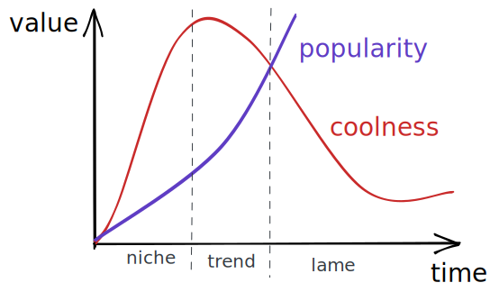
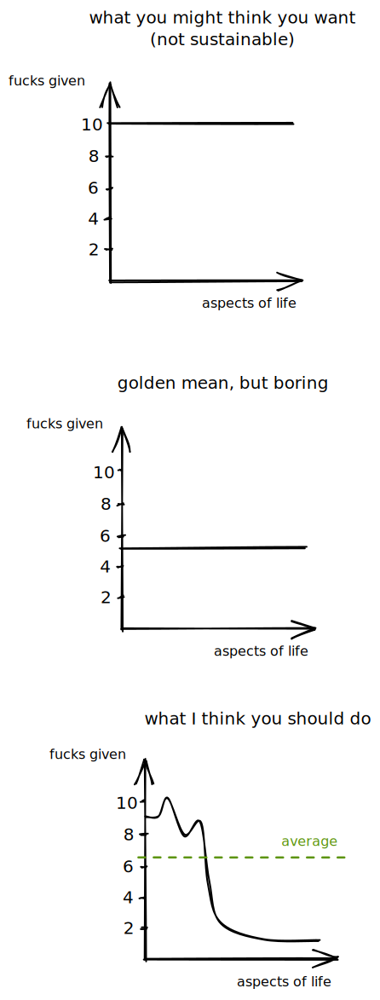

+++
title= "Mid is good"

date= 2022-09-01

[extra]
sub = "A mini-essay about a stupid internet trend and Greek philosophy"
+++

A recent online trend the dear Reader may have noticed is teenagers[^1] using the simple three-letter word *mid* under various forms of online content. It's a meme in the Dawkins [^2] sense; a decentralized idea that spread quickly but was probably not intended to go viral. You use it to describe something that's not that impressive, a shorter form of commenting *every average joe could do this* under a piece of art, or really, anything else, some may even go as far as to say a degradatory term. It made its way through the hells of all the trendy platforms, and is now defined on Urban Dictionary[^3] and Know your Meme[^4]

**I do not agree with the ideas behind it.**

## Not like the other girls

Younger generations always strived for individuality and the notion of being unique. For instance, in the 60s, there was beat music (which you may also know as *rock*). Those hippies! Cried the parents! They don't respect the Lord! How unholy is that sound which they call "music"!
Remember when cigarettes were cool? That's the same, too. Teens, who want to generate as much outrage and originality as possible downed the fumes down by the 10-pack. I don't think many liked it, but they continued to smoke because it was cool. And also, because parents put oil on the fire telling them not to.

In the midst[^5] of the 2010s, a new "trend" like that has emerged; what better way to signal that you're unique than stating it black and white? This, the phrase *I'm not like the other girls* was born. More and more people started using it, and, needless to say, it [^6] became a meme[^7], too. And that killed the whole genre: if *not like other-girls*-iness is used by a lot of people, it inflates. Most of these niches either die (NLOgirls) or become a part of meta, suddenly not that controversial at all (beat, cigs in the form of vapes).

## Aurea mediocritas

You've probably heard this expression. If you didn't; this is latin for the Golden Mean[^8], the idea that one should avoid extremes and strive to make reasonable, sane decisions, balanced betweeen Excess and Deficiency. When Aristotle (previously Plato and Socrates) caught on to this, they created what can be described as an antique trend. [^9] People wanted to be as balanced as possible. **Right in the middle**.

Thinking about it that way, ***mid* is, pretty damn good**. It isn't bad; it does not harm others; but it isn't perfection; there **is** always room to improve[^10], and you **should improve things you care about by all means**. More on this later.

Now if this is universal, and always the right thing to do is debatable; I'm not here for arguing about those (Socrates and the Sophists beat me by about 1600 years[^11] to that). And also, I don't want to sound like a boomer. Remember, antique philosophers also invented [carpe diem](https://en.wikipedia.org/wiki/Carpe_diem)

## What I've found to work

> This is a segment about how to organize your life, mostly for perfectionists.

I **don't think that you can sustain perfection**[^12]. A common religious belief is that this is because **perfection is reserved to a god**, like some weird [royal prerogative](https://en.wikipedia.org/wiki/Royal_prerogative), but in my opinion, the answer is much simpler. Ain't no one got time for that. Perfection is like infinity. You *can* define it, and you *can* start working your way torwards it from ground zero, but no matter how you try, the goalpost moves; there's an $n+1$. Other areas, wheere you are *also* supposed to be 10/10 will suffer; there's only so much time in the day

Summed up, I'd advise anyone that comes to me the following:
- find a few topics to excel at / a few ideas that you strongly approve
- do just good enough / be mostly neutral on most things else
- achieve some sort of aurea mediocritas; because the two extremes on the top will balance each other out. If you want to be an interesting person, aim for an average above 5 on the "fucks given" scale

[^1]: mostly, from what I've seen

[^2]: [https://en.m.wikipedia.org/wiki/Meme#CITEREFDawkins1989](https://en.m.wikipedia.org/wiki/Meme#CITEREFDawkins1989)

[^3]: [https://www.urbandictionary.com/define.php?term=mid](https://www.urbandictionary.com/define.php?term=mid)

[^4]: [https://knowyourmeme.com/memes/mid-internet-slang](https://knowyourmeme.com/memes/mid-internet-slang)

[^5]: pun intended

[^6]: [https://www.urbandictionary.com/define.php?term=Not%20Like%20Other%20Girls](https://www.urbandictionary.com/define.php?term=Not%20Like%20Other%20Girls)

[^7]: [https://www.reddit.com/r/notliketheothergirls/](https://www.reddit.com/r/notliketheothergirls/)

[^8]: [https://en.wikipedia.org/wiki/Golden_mean\_(philosophy)](https://en.wikipedia.org/wiki/Golden_mean\_(philosophy))

[^9]: [https://en.wikipedia.org/wiki/Virtue_ethics#History_of_virtue](https://en.wikipedia.org/wiki/Virtue_ethics#History_of_virtue)

[^10]: I've been meaning to write an essay titled *Progressive Overload Everything* similar to this one, but haven't found the time for it yet

[^11]: [https://en.wikipedia.org/wiki/Sophist#Criticism](https://en.wikipedia.org/wiki/Sophist#Criticism)

[^12]: [https://www.psychologytoday.com/us/blog/shift-mind/200811/the-problem-perfection](https://www.psychologytoday.com/us/blog/shift-mind/200811/the-problem-perfection)
